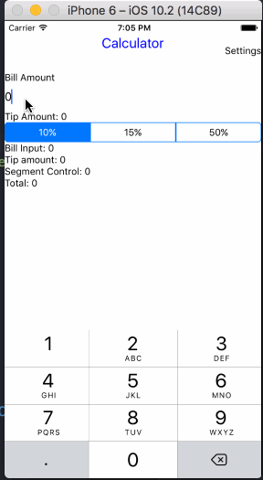
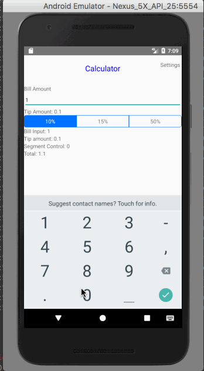

# Pre-work - *Tip Calculator*

**Calculator** is a tip calculator application for React Native.

Submitted by: **Guy Morita**

Time spent: **3 + setup** hours spent in total

**Note** we do not require build this app for all Mobile OS, just based on what is fit for you.

## Usage

Write steps to run your project on locally
**Install**
```
npm install
```

**Start the application in development mode**
```
react-native run-android
react-native run-ios
```

## User Stories

The following **required** functionality is complete:

* [x] User can enter a bill amount, choose a tip percentage, and see the tip and total values.
* [x] Settings page to change Scene Transition
* [x] Navigator integrate (keep it's simple)

The following **optional** features are implemented:
* [ ] UI animations
* [x] Settings page to change the default tip percentage.
* [ ] Using locale-specific currency and currency thousands separators.
* [ ] Making sure the keyboard is always visible and the bill amount is always the first responder. This way the user doesn't have to tap anywhere to use this app. Just launch the app and start typing.

The following **additional** features are implemented:

- [ ] List anything else that you can get done to improve the app functionality!

## Video Walkthrough

Here's a walkthrough of implemented user stories:



